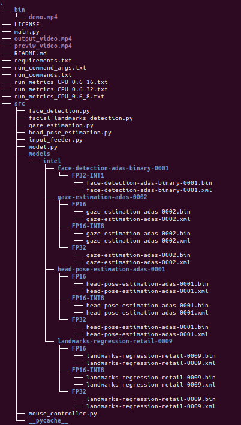
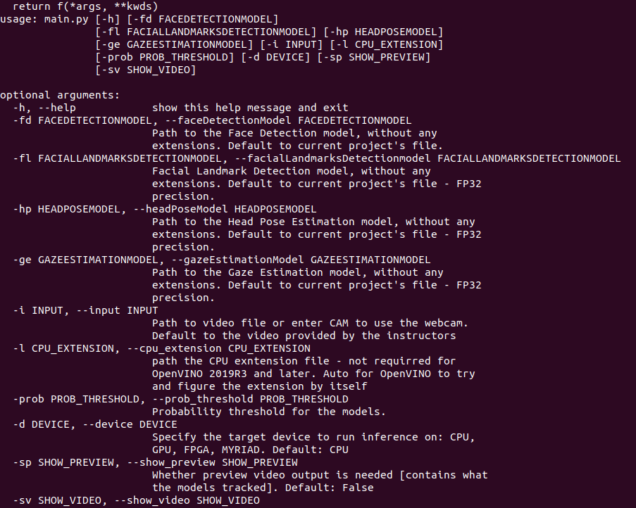

# Computer Pointer Controller

This is a project developed as the final project of the Udacity's Intel® Edge AI for IoT Developers Nanodegree. It consists of an application that takes as an input a video file of a camera feed, and though the gaze direction of the tracked person it controls the mouse movement.

## Project Set Up and Installation

1. Install OpenVINO toolkit. For this project we used [Intel OpenVINO 2020R2 version](https://docs.openvinotoolkit.org/2020.2/index.html). If it is not installed in your system, download and install it from the link provided above, following the instructions for your system. <br/>
As a note, as the final step you can either add to the system PATH the OpenVINO, or else you should add the following line (in the case of linux OS - equivalent commands exist for other OS) in order to initialize the OpenVINO enviroment in every bash window you open. 
```bash
source /opt/intel/openvino/bin/setupvars.sh
```
2. After installing the OpenVINO and initializing it, we must donwload the required models, based on the instructions provided. As a note using the following commands will download the models, in a folder named `model`, but we could specify a different folder using the -o argument, followed by the path to the folder we want to download the model.  <br/>
we will need the following models. After each model the command to download it is provided <br/>
- [Face Detection Model](https://docs.openvinotoolkit.org/latest/_models_intel_face_detection_adas_binary_0001_description_face_detection_adas_binary_0001.html) <br/>
```bash
python3 /opt/intel/openvino/deployment_tools/tools/model_downloader/downloader.py --name "face-detection-adas-binary-0001"<br/>
``` 
- [Facial Landmarks Detection Model](https://docs.openvinotoolkit.org/latest/_models_intel_landmarks_regression_retail_0009_description_landmarks_regression_retail_0009.html) <br/>
```bash
python3 /opt/intel/openvino/deployment_tools/tools/model_downloader/downloader.py --name "landmarks-regression-retail-0009"
```

- [Head Pose Estimation Model](https://docs.openvinotoolkit.org/latest/_models_intel_head_pose_estimation_adas_0001_description_head_pose_estimation_adas_0001.html) <br/>
```bash
python3 /opt/intel/openvino/deployment_tools/tools/model_downloader/downloader.py --name "head-pose-estimation-adas-0001"
```


- [Gaze Estimation Model](https://docs.openvinotoolkit.org/latest/_models_intel_gaze_estimation_adas_0002_description_gaze_estimation_adas_0002.html)
```bash
python3 /opt/intel/openvino/deployment_tools/tools/model_downloader/downloader.py --name "gaze-estimation-adas-0002"
```
3. Then we need to install the requirments, as they are stated in the requirements.txt file. In order to do that, we run the following command
```bash
pip3 install -r requirements.txt
```

**Project Structure** <br/>
In this part we will present how the project is structured. The followin picture was obtained using the following command, from the base directory
```bash
tree -d
```


As we can see it follows the structure that was provided by the instructors. Inside the `bin` directory is placed the input video used for testing. The `main.py` file, which is used to run the programm, is located in the topmost folder, and calls each of the requirred models. <br/>
Regarding the models, the `model.py` was used as the base class, providing the basic functionality for the other models, which are subclasses of this class.

## Demo
In order to run the programm, using the default values (which means FP32 precision, device set to CPU and the models to be placed according the above image), the following command should be used
```bash
python3 main.py
```
It must be noted that there are arguments that can be used to add extra functionality, that will be discussed later. For a bigger list of commands that can be used and cover most cases in the case of CPU and GPU device, are presented in the [run_commands.txt file](run_commands.txt)

## Documentation
As it was stated above, the application can take as input several arguments. In order to see which they are, and their functionality, the following command can be used
```bash
python3 main.py --help
```
The result of the command is presented below


A brieF discussion about each arguments follows <br/>
**faceDetectionModel** 
The path ot the Face Detection Model we downloaded before. It should contain the final file, without any extensions. If it is not provided it will link the the FP32 precision case (src/models/intel/face-detection-adas-binary-0001/FP32-INT1/face-detection-adas-binary-0001)
**facialLandmarksDetectionmodel** 
The path ot the Facial Landmarks Detection Model we downloaded before. It should contain the final file, without any extensions. If it is not provided it will link the the FP32 precision case (src/models/intel/landmarks-regression-retail-0009/FP32/landmarks-regression-retail-0009)
**headPoseModel**
The path ot the Head Pose Estimation Model we downloaded before. It should contain the final file, without any extensions. If it is not provided it will link the the FP32 precision case (src/models/intel/head-pose-estimation-adas-0001/FP32/head-pose-estimation-adas-0001)
**gazeEstimationModel**
The path ot the Gaze Estimation Model we downloaded before. It should contain the final file, without any extensions. If it is not provided it will link the the FP32 precision case (src/models/intel/gaze-estimation-adas-0002/FP32/gaze-estimation-adas-0002)
**input**
The path to the input video (default to bin/demo.mp4). If CAM input is needed, we should type `CAM`
**cpu_extension**
The path to the CPU extension, which is used in the case there are not supported layers. This is mainly used for compability issues, since the version of OpenVINO we are using does not support it. Also, if we type there `auto` the program will try to find the extension by itself, based on the OS that is used.
**prob_threshold**
The probability threshold to accept the results of each model. One value is used for all models, default to 0.6
**device**
The device on which we will run inference on
**show_preview**
Setting this to True will display a window showing the input of the programm, and with what was tracked by the algorithm (bounding boxes and values reagarding the gaze estimation). As a note, setting this to False, the output video of those attributes will not be made.
**show_video**
Setting this to False will not show the input video. Used for benchmarking mainly

Based on the input, there is a txt file produced, which contains several info regarding the program. The data contained in the file, are shown in the following part.

## Benchmarks
The programm was run on my local machine, which is Ubuntu 18.04, running on a VM with 2 cores of Intel I3-6100 CPU, and 4 GB of RAM. There were several test cases, in order to check how the performance changed. As a note, the device was always the CPU, since in a VM the GPU is not supported.


## Results
*TODO:* Discuss the benchmark results and explain why you are getting the results you are getting. For instance, explain why there is difference in inference time for FP32, FP16 and INT8 models.

## Stand Out Suggestions
This is where you can provide information about the stand out suggestions that you have attempted.


### Edge Cases
There will be certain situations that will break your inference flow. For instance, lighting changes or multiple people in the frame. Explain some of the edge cases you encountered in your project and how you solved them to make your project more robust.
